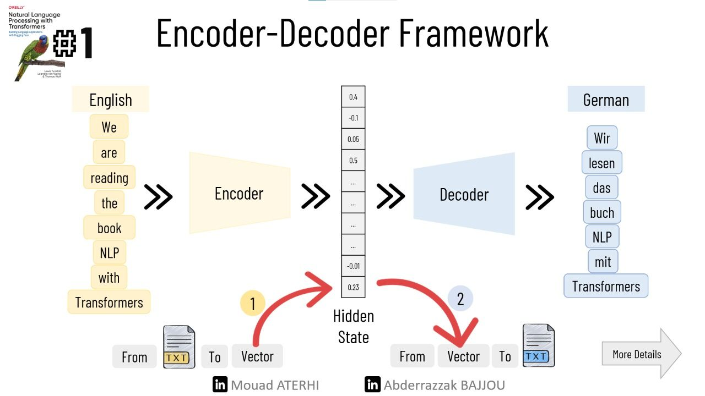
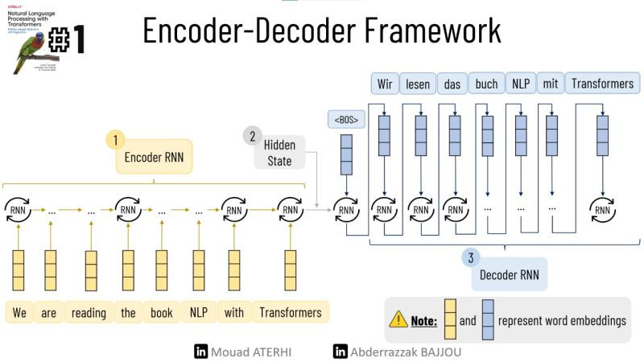
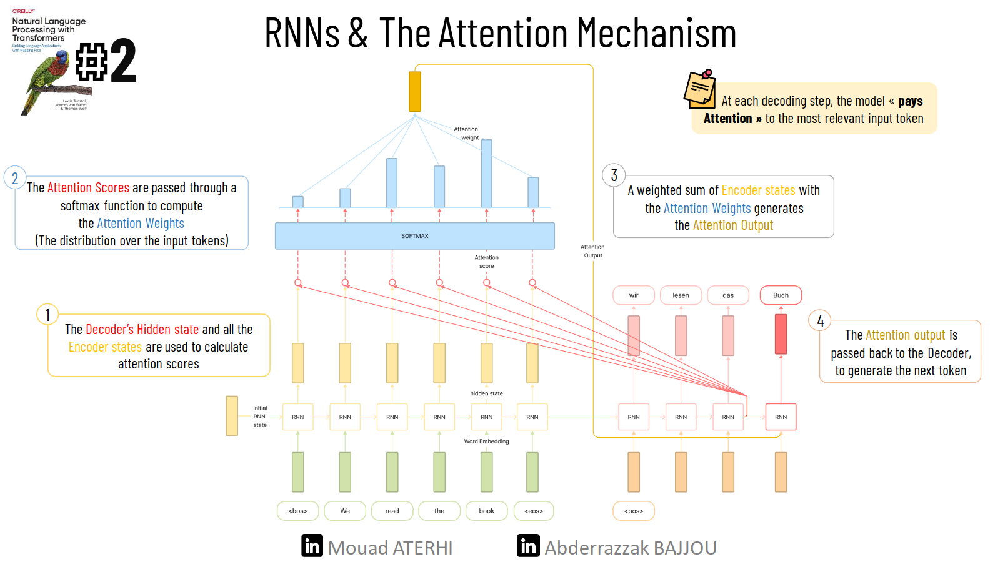

# NLP with Transformers Chapter 1 :

Language is at the core of human communication, and for centuries, we've endeavored to unravel how it is intricately woven into our cognitive processes. Today, we are on a quest to advance further by introducing computers to the realm of human language through **Natural Language Processing (NLP)**. NLP is an artificial intelligence branch dedicated to harnessing machine learning techniques for a wide range of language-related tasks.

In recent years, NLP has witnessed a remarkable evolution with the emergence of transformative techniques such as **transformers**, the **encoder-decoder framework**, and the **attention mechanism**. These innovations have reshaped the landscape of NLP. To gain a deep understanding of these developments, one of the most valuable resources is the book **Natural Language Processing with Transformers: Building Language Applications with Hugging Face**, which we are summarizing in this series of articles.

## The Encoder-Decoder Framework

The concept of an encoder-decoder, also known as a **sequence-to-sequence architecture**, made its debut in 2014 with the publication of the "Sequence to Sequence Learning with Neural Networks" paper by a Google research team. This architecture finds its forte in scenarios where both the input and output entail sequences of arbitrary lengths.

Comprising two core components:

- **The Encoder** : It processes the input sentence word-by-word using recurrent models (RNN/LSTM/GRU), and produces a representation of the entire sentence in a hidden space.
- **The Decoder** : retrieves this hidden state (representation) and generates an output.

The following slides provide an overview of the inner workings of the architecture of a translation task  🎯!
   
   


1. **Word Embedding**: Each word is represented by a dense, low-dimensional vector.
2. **The Encoder**: It processes the input sentence sequentially using the RNN cells and produces the final hidden state, which is the sentence representation.
3. **The Decoder**: At each step, using the hidden state and the embedding of the previous token, it generates the next most probable token.

However,😕 a notable weakness of this architecture lies in the final hidden state of the encoder, which imposes an ***information bottleneck***. This state must encapsulate the meaning of the entire input sequence since it serves as the sole source of information for the decoder during output generation. This limitation becomes particularly pronounced when dealing with longer input sequences.


## The Attention Mechanism

The core concept behind the **Attention mechanism** is the assignment of weights to data, specifically to tokens (words in our context). Instead of producing a single hidden state for the entire input sequence, the encoder generates a hidden state at each step. This allows the decoder to access these individual states and make decisions regarding which portions of the input are most important and relevant at each step of the output generation.🎯 Through this mechanism, the model becomes capable of learning non-trivial alignments between words in the generated translation and those present in the source sentence.

### An Illustrative Example

To grasp the significance of the Attention mechanism, consider the following example. The figure below demonstrates the alignment of the words "zone" and "Area" using an attention-based decoder, even when these words are ordered differently in the source sentence and the translation.


### The following figure explains the process of applying the attention mechanism on an RNN.



But Although adding the attention mechanism to RNNs has improved performance and produced much better translations,😕 training RNNs on large datasets is time-consuming as they are not parallelizable ( ***Curse of recurrence!!*** ).

This is where **Transformers** shines with the introduction of **self-attention**, a mechanism that operates on all states in the same layer of a neural network. The outputs of the self-attention mechanisms serve as input to feed-forward networks.
This architecture trains much faster than recurrent models and improves performance.

The following example illustrates the functionality of this mechanism:


## Transfer Learning in NLP

If you are familiar with computer vision, you have probably heard of a concept called Transfer Learning, unless you are training your CNN architectures from scratch, in which case you should consult a therapist👨‍⚕️ !


🎯 Transfer learning is the process of applying an existing trained model to a new, but related task. Architecturally, this involves dividing the model into a body and a head, The head is the task-specific portion of the network, while
The body contains broad features from the source domain learned during training. During learning, the body weights learn general features, for images it learns basic features such as lines, edges, and colors... then these weights are used to initialize a new model for the new task.


While achieving great success in computer vision, the pre-training process for Natural Language Processing (NLP) was far from straightforward 😕. However, a significant breakthrough came with the introduction of ULMFiT, which provided the pivotal missing piece to ignite the transformer revolution.

The ULMFiT framework comprises three fundamental steps:

1. **Pre-training (Language Modeling)**: Initially, a language model is trained to predict the next word based on the preceding words within a large-scale generic corpus, typically sourced from Wikipedia text.

2. **Domain Adaptation**: The language model is subsequently fine-tuned to predict the next word, this time aligning its predictions with the target in-domain corpus.

3. **Fine-Tuning**: The language model undergoes further refinement, incorporating a classification layer for the specific target task, such as text classification.

The following example explains the process of building a Twitter sentiment classifier using transfer learning.


In 2018, a monumental breakthrough occurred with the introduction of two transformer architectures: GPT and BERT. GPT only uses the decoder part of the Transformer architecture and the language modeling approach as ULMFiT. In contrast,BERT uses the encoder part of the Transformer architecture and a form of language modeling called masked language modeling 🎭.(Masked language modeling requires the model to fill in randomly missing words in a text.)
 

The collective impact of GPT and BERT was groundbreaking. They set a new gold standard across a diverse array of NLP benchmarks, marking the inauguration of a transformative chapter in the history of transformers. 🌟

## A Tour of Transformer Applications
After understanding  the architecture of Transformers, let's check what they are capable of 🚀❗️

Using Hugging Face 🤗, an open-source library, we can perform complex NLP tasks using state-of-the-art models. Hugging Face Transformers has a layered API that allows users to interact with the library at various levels of abstraction.

💻 For this example, we will generate a text, then perform sentiment analysis, named entity recognition, question answering, and finally translate it into German with an average of 3 lines of code for each task.

Installing the requirements  :
```
!pip install transformers
!pip install sentencepiece
```

```python
from transformers import pipeline
import pandas as pd
```

### Text generation 
 We will start our tour by generating the rest of the test **"Thanks to  AI, we can promote the development of the African region, and"** using the test-generation supported task by pipeline.


  
```python
#initiate the generator
generator = pipeline("text-generation")

#what's your text
text = "Thanks to  AI, we can promote the development of the African region, and"

#completing the paragraph
outputs = generator(text, max_length=30, num_return_sequences=1)

generated_text = outputs[0]['generated_text']
#printing the result
print(generated_text)
```
**The output** :
Thanks to  AI, we can promote the development of the African region, and it may lead to faster productivity growth through better local governance.

### Sentiment Analysis :

Then we will apply sentiment analysis to the generated text, using pipeline.

  
```python
#initiate the sentiment analysis pipeline
classifier = pipeline("sentiment-analysis")

#get prediction
outputs = classifier(generated_text)

#printing the result
print(pd.DataFrame(outputs))
```
**The output**:

|    label   |   score   |
|:----------:|:---------:|
|  POSITIVE  | 0.998763  |

### Named-Entity recognition :

Next step is applying named entity recognition (NER). using pipeline.

```python
#initiate the NER Tagger
ner_tagger = pipeline("ner", aggregation_strategy="simple")

#Detecte entities
outputs = ner_tagger(generated_text)

#printing the result
print(pd.DataFrame(outputs))
```

**The output:**
| entity_group |   score   |   word   | start |  end  |
|:------------:|:---------:|:-------:|:-----:|:----:|
|     ORG      | 0.977671  |   AI    |  11   |  13  |
|    MISC      | 0.999172  | African |  53   |  60  |
|    MISC      | 0.999294  | African | 105   | 112  |


### Question Answering :
what about answering some questions based on the information in our generated text?

```python
#intitiate the QA pipeline
reader = pipeline("question-answering")

#Our question
question = "How can we promote the development of the African region?"
#extract the answer from the generated text
outputs = reader(question=question, context=generated_text)
#printing the result
print(pd.DataFrame([outputs]))
```

**The output:**

|   score  | start |  end  | answer |
|:-------: |:-----:|:----: |:------:|
|  0.5826  |   11  |  13   |   AI   |


### Translation :
Finally, we will translate the generated text into German.

```python
#initiate the translator from "English" to "German"
translator = pipeline("translation_en_to_de", model="Helsinki-NLP/opus-mt-en-de")

#translate the generated text
outputs = translator(generated_text, clean_up_tokenization_spaces=True, min_length=100)
translated_text = outputs[0]['translation_text']

#printing the output
print(translated_text)

```

**The output:**
Dank KI können wir die Entwicklung der afrikanischen Region fördern, und es kann zu einem schnelleren Produktivitätswachstum durch eine bessere lokale Governance führen. Ab von KI können wir die Entwicklung der afrikanischen Region fördern, und es kann zu einem schnelleren Produktivitätswachstum durch eine bessere lokale Governance führen

