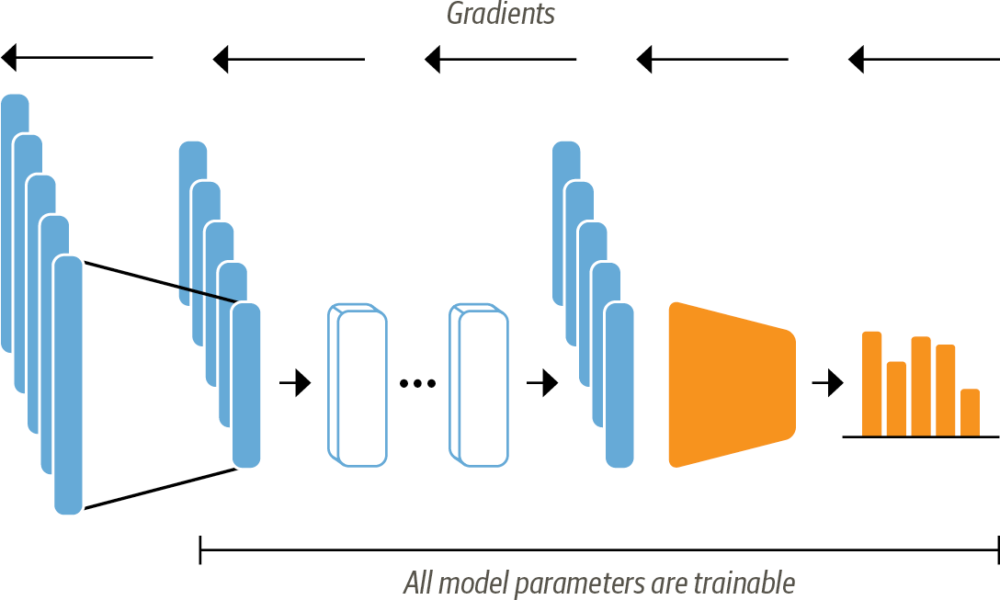

<!-- chap2 Structure : 
Introduction: Overview of the pipeline 
1-A first look at the hagging face dataset:
    -importing the emotions dataset
    -about the dataset object
    - How long are our tweets?
2- Tokenisation :
    -character/world tokenization (A quick explanation and why we won't use them)
    -Subworld tokenization (including code and examples)
    -tokenizing the hall dataset (about the map() method)
3- Training a Text classifier : 
    -Transformers as feature extractors : 
        -importing DistilBert as a pre-trained model
        -Extracting the last hidden states for the hall dataset
        -Creating a feature matrix
        -Visualizing the training set
        -Adding a Logistic regression Layer and validating his performance with the confusion matrix
    -Fine-tuning Transformers:
        -About fine-tuning
        -Loading the pre-trained Distilbert for classification
        -defining the metrics: F1_score and accuracy
        -Training the model : 
            -defining the training arguments
            -training the model and calculating the metrics
            -plotting the confusion matrix
        -Error analysis (if the article is already too long we might not include this part)
4- connecting the model with an API would be nice ...
 -->

 # NLP with Transformers chapter 2: Text classification
 Text classification is one of the most common tasks in NLP; it can be used for a broad range of applications, such as tagging customer feedback into categories or routing support tickets according to their language. 🌐 Whenever your email goes to spam, or a social media platform rejects your post or deletes your comment because it's "morally inappropriate,🍉 🇵🇸" chances are very high that a text classifier is involved. 🕵️‍♂️ Another common type of text classification is sentiment analysis, which aims to identify the polarity of a given text. In this article, we will see a step-by-step guide for building our sentiment analysis model using the transformer architecture. 🚀

 ### About the pipeline :

The goal is to build a system that automatically classifies emotions expressed in Twitter messages about a product. 🛠️ The model will take a single tweet as input and assign one of the possible labels, including anger, fear, joy, love, sadness, and surprise.

we’ll tackle this task using a variant of BERT called ***DistilBERT***. The main advantage of this model is that it achieves comparable performance to BERT while being significantly smaller and more efficient. We will follow the typical pipeline for training transformer models in the **hugging face**  ecosystem.🤗

   


    
First, we'll load and process the dataset using the ***dataset*** library. Next, we'll tokenize the dataset using the ***Tokenizers*** library. This enables us to train our text classifier using two distinct approaches: first, utilizing transformers as feature extractors, and second, fine-tuning the DistilBERT model for a classification task. Finally, we'll load the fine-tuned model into the ***Datasets*** library for future reuse.🚀❗️


## The dataset: 

To build our emotion detector we’ll use a great dataset from an article that explored how emotions are represented in English Twitter messages and classify themes into six different polarities, anger, disgust, fear, joy, sadness, and surprise. 

### Loading the dataset:

```
<!-- loading the packages -->
!pip install transformers
!pip install sentencepiece
!pip install datasets
```

```python
from datasets import load_dataset

"""NOTE: The hagging face dataset has more than 1700 datasets 
 You can load any theme by passing their name to the load_dataset function """
 

emotions = load_dataset("emotion")
print(emotions)
#acceding the train split
train_ds = emotions["train"]
print(train_ds)
len(train_ds)

print(train_ds.column_names)
#acceding to the first element of the train split
print(train_ds[:5])

"""  {'text': 
    ['i didnt feel humiliated',
     'i can go from feeling so hopeless to so damned hopeful just from being around someone who cares and is awake',
    'im grabbing a minute to post i feel greedy wrong',
    'i am ever feeling nostalgic about the fireplace i will know that it is still on the property', 
    'i am feeling grouchy'],
     'label': [0, 0, 3, 2, 3]} """

```
If we look inside our emotions object, we see it is similar to a Python dictionary, with each key corresponding to a different split. We can use the usual dictionary syntax to access an individual split

```
    DatasetDict({

        train: Dataset({
            features: ['text', 'label'],
            num_rows: 16000
    }),
        validation: Dataset({
            features: ['text', 'label'],
            num_rows: 2000
    }),
        test: Dataset({
            features: ['text', 'label'],
            num_rows: 2000
    })
})

    Dataset({
        features: ['text', 'label'],
        num_rows: 16000
    })
     
    
```

### Processing the dataset :
For access to great data visualization APIs, it is convenient to convert a dataset object to a **Pandas** dataframe using the ***set_format()***  methods :
```python
emotions.set_format(type="pandas")
df = emotions["train"][:]
#As labels are represented as integers, 
# We are creating a new column in the dataframe for the corresponding names
def label_int2str(row):
    return emotions["train"].features["label"].int2str(row)
df["label_name"] = df["label"].apply(label_int2str)
df.head()
```

| text                                           | label | label_name |
| ---------------------------------------------- | ----- | ---------- |
| i didnt feel humiliated                         | 0     | sadness    |
| i can go from feeling so hopeless to so damned... | 0     | sadness    |
| im grabbing a minute to post i feel greedy wrong | 3     | anger      |
| i am ever feeling nostalgic about the fireplac... | 2     | love       |
| i am feeling grouchy                            | 3     | anger      |

### How long are our Tweets ?
Transformer models have a maximum input sequence length that is referred to as the
maximum context size. For DistilBERT the maximum context size is 512 tokens, which amounts to a few paragraphs of text.

```python
#Ploting the lenth of world for every label :
df["Words Per Tweet"] = df["text"].str.split().apply(len)
df.boxplot("Words Per Tweet",by="label_name",
    grid=False,
    showfliers=False, color="black")
plt.suptitle("")
plt.xlabel("")
plt.show()

```


Most tweets are between 15 and 20 words long, with a max length of around 50 words, which is well below DistilBERT’s maximum context size. Texts that are longer than a model’s context size need to be truncated, which can lead to a loss in performance if the truncated text contains crucial information.

## From Text to Tokens: Tokenization
Transformer models like DistilBERT cannot receive raw strings as input; instead, they
assume the text has been tokenized and encoded as numerical vectors. Tokenization is
the step of breaking down a string into the atomic units used in the model. The three main tokenization strategies are character tokenization, word tokenization, and subword tokenization.


### Character Tokenization :
The simplest tokenization scheme is to feed each character individually to the model. So to tokenize the following example **"Tokenizing text is a core task of NLP."**, we can just list the text and we will obtain: **['T', 'o', 'k', 'e', 'n', 'i', 'z', 'i', 'n', 'g', ' ', 't', 'e', 'x', 't', ' ', 'i', 's', ' ', 'a', ' ', 'c', 'o', 'r', 'e', ' ', 't', 'a', 's', 'k', ' ', 'o', 'f', ' ', 'N', 'L', 'P', '.']**. This will allow us to create a dictionary to map each character with a unique integer:

```python
{' ': 0, '.': 1, 'L': 2, 'N': 3, 'P': 4, 'T': 5, 'a': 6, 'c': 7, 'e': 8, 'f': 9, 'g': 10, 'i': 11, 'k': 12, 'n': 13, 'o': 14, 'r': 15, 's': 16, 't': 17, 'x': 18, 'z': 19}
```
We can now transform our initial text to a list of integers: **[5, 14, 12, 8, 13, 11, 19, 11, 13, 10, 0, 17, 8, 18, 17, 0, 11, 16, 0, 6, 0, 7,
14, 15, 8, 0, 17, 6, 16, 12, 0, 14, 9, 0, 3, 2, 4, 1]**.
The final step will be converting a numerical vector to a 2D tensor of **One-hot vectors**.
#### Side note :
In machine learning, one hot encoding is used when you need to represent categorical data where each category is represented by a unique binary value (0 or 1). For example, if we have three categories: "red," "green," and "blue," a one-hot vector encoding would represent these categories as follows:

- "red" would be represented as `[1, 0, 0]`
- "green" would be represented as `[0, 1, 0]`
- "blue" would be represented as `[0, 0, 1]`

This encoding scheme ensures that each category is distinctly represented by a binary vector, making it suitable for input to machine learning algorithms that require numerical input data.

For our case, we will encode each character with a one-hot vector of size equal to the number of unique characters in the sequence. Each vector will have zeros everywhere except for its corresponding index in the sorted array of unique characters.

Character tokenization results in a smaller vocabulary and much fewer out-of-vocabulary tokens. but it results in a much higher number of tokens for a given input sequence and it's not meaningful and needs to learn linguistic structures from the data which makes the training more expensive. That's why most projects do not use it.

###  Word Tokenization :
Rather than breaking the text into individual characters, we can segment it into words and assign each word an integer. This method reduces the model's workload since it doesn't have to learn complex linguistic structures. The simplest word tokenizers split text based on spaces.
```python
tokenized_text = text.split()
print(tokenized_text)

# Output:
# ['Tokenizing', 'text', 'is', 'a', 'core', 'task', 'of', 'NLP.']
```
From here, we can follow similar steps to what we did with the character tokenizer to assign IDs to each word. However, this approach can introduce several potential problems. For example, punctuation marks like periods can create ambiguous tokens like 'NLP.' Additionally, words may have different forms due to declensions, conjugations, or misspellings, leading to a large vocabulary size potentially reaching millions, and requiring more model parameters.

A common strategy to address this is limiting the vocabulary size by including only the 100,000 most frequent words in the corpus. Words not part of the vocabulary are considered unknown and mapped to a shared token. However, this approach risks losing valuable information related to rare words.

### Subword Tokenization :
The basic idea behind subword tokenization is to combine the best aspects of character and word tokenization. By splitting rare words into smaller units, we enable the model to handle complex vocabulary while maintaining manageable input lengths by treating frequent words as unique entities. For more details check the last [vedio](https://www.youtube.com/watch?v=zduSFxRajkE) from **Andrej Karpathy** about the Tokenizer used in GPT.


```python

from transformers import AutoTokenizer
# Specifying the pre-trained model checkpoint to be used
model_ckpt = "distilbert-base-uncased"
# Initializing a tokenizer object by loading the pre-trained tokenizer associated with it.
tokenizer = AutoTokenizer.from_pretrained(model_ckpt)

```
Let's apply the tokenizer on our previous exemple : 

```python
# Apllying the tokenizer to our example
encoded_text = tokenizer(text)
print(encoded_text['input_ids'])
"""  Output :
 [101, 19204, 6026, 3793, 2003, 1037, 4563, 4708, 1997, 17953, 2361, 1012, 102] """
# converting the IDs to the corresponding tokens
tokens = tokenizer.convert_ids_to_tokens(encoded_text.input_ids)
print(tokens)
""" Output :
 ['[CLS]', 'token', '##izing', 'text', 'is', 'a', 'core', 'task', 'of', 'nl', '##p', '.', '[SEP]'] """
# converint the tokens to the original text 
print(tokenizer.convert_tokens_to_string(tokens))
"""Output: 
 [CLS] tokenizing text is a core task of nlp. [SEP] """
```
We can observe that the words have been mapped to unique integers. By converting the IDs back to tokens, we notice the emergence of some new tokens such as '[CLS]', indicating the start, and '[SEP]', indicating the end of a sequence. Additionally, the word 'tokenizing' has been split into two tokens: 'token' and '##izing' as well as NLP. 

Finally, we can tokenize the whole emotions dataset using the .map()
method :
```python
# Define a function named "tokenize" that takes a batch of data as input
def tokenize(batch):
    return tokenizer(batch["text"], padding=True, truncation=True)

# Apply the "tokenize" function to the dataset "emotions" in batches
emotions_encoded = emotions.map(tokenize, batched=True, batch_size=None)

```
## Training a Text Classifier :
Pretrained models such as DistilBERT are initially trained to predict masked words within a sequence. To adapt them for text classification tasks, we integrate the pretrained model's core architecture with a custom classification head, effectively combining the model's pretrained body with a tailored classification component.

We will explore two methodes to train a text classifier : 

**Feature Extraction** : Use the hidden states as features and train the classifier on them without modifying the pretrained model.

**Fine-tuning** : Train the whole model end-to-end, which also updates the parameters of the pretrained model.


### Transformers as feature extractures :

Using a transformer as a feature extractor is fairly simple.We freeze the body’s weights during training and use the hidden states as features for the classifier.Since the hidden sates only need to be calculated once this is a convenient approach to quickly train a small model.Such a model could be a neural classification layer or a method that does not rely on gradients, such as a random forest.


**In the feature-based approach, the DistilBERT model is frozen and just pro‐
vides features for a classifier**

#### feature extraction : 
The best way to understand this part is to see it in action, we will extract the hidden state of ***' this is a test '***. First we will tokenize it and pass the tokenized tensor as input to a pretrained model to extract the last hidden states of all the tokens :
```python
# Tokenizing the text : 
text = "this is a test"
inputs = tokenizer(text, return_tensors="pt") 

# Loading the model :
from transformers import AutoModel
model_ckpt = "distilbert-base-uncased"
# Definign the device as a GPU if available or else as CPU
device = torch.device("cuda" if torch.cuda.is_available() else "cpu")
# Load pretrained DistilBert model without the last layer
model = AutoModel.from_pretrained(model_ckpt).to(device)

# Extraction the hidden states : 

# Placing the encodings in the same device as the model
inputs = {k:v.to(device) for k,v in inputs.items()}
with torch.no_grad():
    # Applying the model to all our tokens
    outputs = model(**inputs)
print(outputs)

# Checking the size of our output 
outputs.last_hidden_state.size()
""" torch.Size([1, 6, 768]) """
```
Looking at the size of our output, '1' refers to the batch size, indicating that we are processing just one sentence in this example. '6' represents the number of tokens, and it is 6, not just 4, because our tokenizer adds special tokens. As you may recall from the last part, '[CLS]' indicates the start of a sequence, and '[SEP]' indicates the end of a sequence. Lastly, '768' represents the dimensionality of the hidden state vector.

In classification tasks, it is a common practice to use the hidden state of the '[CLS]' token as a feature vector to classify the entire sentence. We can extract it as follows:
```python
outputs.last_hidden_state[:,0]
```
So now we will just apply the same process on all the sequences in the emotions dataset : 

```python
def extract_hidden_states(batch):
    # Place model inputs on the GPU
    inputs = {k:v.to(device) for k,v in batch.items()
    if k in tokenizer.model_input_names}
    # Extract last hidden states
    with torch.no_grad():
    last_hidden_state = model(**inputs).last_hidden_state
    # Return vector for [CLS] token
    return {"hidden_state": last_hidden_state[:,0].cpu().num()}
# Converting the input_ids and attention_mask columns to the "torch" format
emotions_encoded.set_format("torch",columns=["input_ids","attention_mask", "label"])
# Extract the hidden states across all splits
emotions_hidden = emotions_encoded.map(extract_hidden_states, batched=True)

 ```

#### Creating a feature matrix :

Now the preprocessed dataset contains all the information we need to train a classifier on it. We will use the hidden states as input features and the labels as targets.

```python
import numpy as np
X_train = np.array(emotions_hidden["train"]["hidden_state"])
X_valid = np.array(emotions_hidden["validation"]["hidden_state"])
y_train = np.array(emotions_hidden["train"]["label"])
y_valid = np.array(emotions_hidden["validation"]["label"])
```
#### Training a simple classifier :
Finally we can use our hidden states to train a simple Logisticregression model with Sickit-learn :

```python
from sklearn.linear_model import LogisticRegression
# We increase `max_iter` to guarantee convergence
lr_clf = LogisticRegression(max_iter=3000)
lr_clf.fit(X_train, y_train)
lr_clf.score(X_valid, y_valid)
# The model's accuaracy : 0.633
```

The confusioin matrix associated to this classification model :


We notice that anger and fear are most often confused with sadness, while love and surprise are frequently mistaken for joy.

## Fine tuning Transformeres :

**Fine Tuning** in deep learning is a form of transfer learning. It involves taking a pre-trained model, which has been trained on a large dataset for a general task such as image recognition or natural language understanding, and making minor adjustments to its internal parameters. The goal is to optimize the model’s performance on a new, related task without starting the training process from scratch.

For our context, With the fine-tuning approach we do not use the hidden states as fixed features, but instead train them as shown in next figure. This requires the classification head to be differentiable, which is why this method usually uses a neural network for classification.


**When using the fine-tuning approach the whole DistilBERT model is trained
along with the classification head**

Now let's start our fine-tuning. Fisrt we will load a pretrained model, but this one has a classification head on top of the pretrained model outputs, which can be easily trained with the base model. We just
need to specify how many labels the model has to predict (six emotions for our case).

```python
# Importing the AutoModelForSequenceClassification
from transformers import AutoModelForSequenceClassification

# Defining the number of labels for the classification task
num_labels = 6

# Instantiating a model for sequence classification using the AutoModelForSequenceClassification class
# Loading a pre-trained model checkpoint with the specified number of labels
model = (AutoModelForSequenceClassification
        .from_pretrained(model_ckpt, num_labels=num_labels)
        .to(device))
```

Next, we will define our performance metrics. To do so we will define a compute_metrics() function for the Trainer, it will take a named tuple with predictions and label_ids (True labels) and returns a dictionary that maps each metric's name to its value. For our application, we’ll compute the **F1-score** and the **accuracy** of the model as follows:
```python
from sklearn.metrics import accuracy_score, f1_score

def compute_metrics(pred):
    labels = pred.label_ids #The True labels
    preds = pred.predictions.argmax(-1) # The model's prediction

    # Compute metrics
    f1 = f1_score(labels, preds, average="weighted")
    acc = accuracy_score(labels, preds)
    return {"accuracy": acc, "f1": f1}
```
Next, we will define the training parameteres and finnaly we will train the model using the **Trainer** object from the transformers labrary :🎯

```python
batch_size = 64
# Calculate logging steps based on training dataset size and batch size
logging_steps = len(emotions_encoded["train"]) // batch_size
# Define name for the fine-tuned model
model_name = f"{model_ckpt}-finetuned-emotion"
# Configure training arguments
training_args = TrainingArguments(
    output_dir=model_name,
    num_train_epochs=2,
    learning_rate=2e-5,
    per_device_train_batch_size=batch_size,
    per_device_eval_batch_size=batch_size,
    weight_decay=0.01,
    evaluation_strategy="epoch",
    disable_tqdm=False,
    logging_steps=logging_steps,
    push_to_hub=True,
    log_level="error"
)

# Initialize Trainer object for training the model
trainer = Trainer(
    model=model,  # Pre-trained model to be fine-tuned
    args=training_args,  # Training arguments and configuration
    compute_metrics=compute_metrics,  # Function for computing evaluation metrics
    train_dataset=emotions_encoded["train"],  # Training dataset
    eval_dataset=emotions_encoded["validation"],  # Evaluation dataset
    tokenizer=tokenizer  # Tokenizer associated with the model
)

# Start the training process
trainer.train()
```
We can take a detailed look at the training metrics by calculating and visualising the confusion matrix 


**The model shows promising performance nearing an ideal confusion matrix, yet it frequently confuses "love" with "joy" and "surprise" with "joy" or "fear"**

We notice that the fine-tuned model outperforms the classical classification model, but as a trade-off, it comes with increased computational costs. 📈 It's important to find your own balance between performance and resource allocation. ⚖️

## Conclusion :

Congratulations! 🎉 By reaching this point, you should be equipped with the knowledge of training a text classifier using transformers as feature extractors as well as fine-tuning a transformer model. You're now familiar with the typical Hugging Face pipeline for training a Transformer model. However, this is just the technical aspect; the real challenge lies in applying this knowledge to solve real-life problems effectively. 🚀

### Additional recources : 
[Notebook for sentiment analysis](https://colab.research.google.com/drive/1AVEa_j7h9_06WxzJN2niPAqzLWLFNHHy?usp=sharing) : The code used in this article with extra demonstration and details.