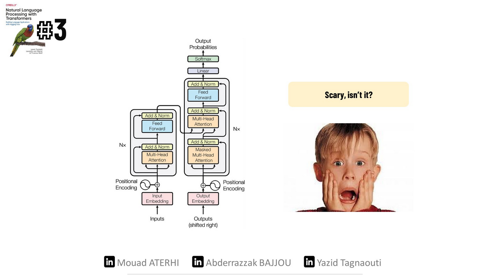
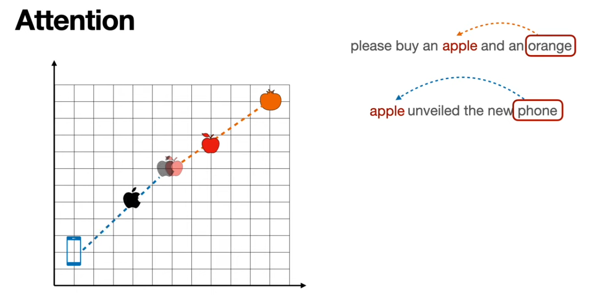

# NLP with Transformers chapter 3: Transformer anatomy
In this chapter, we will dive deeper into the Transformers architecture, exploring the main building blocks of a transformer model. We will first focus on constructing the attention mechanism and then integrate all the necessary components to make the encoder function. Additionally, we'll highlight the key distinctions between the encoder and decoder modules.  
tighten your seatbelt, it's time to explore the wonders of NLP✨.

## The Transformer Architecture
The original form of transformer was initially based on the encoder-decoder architecture primarily used for translation tasks,However, this design faced challenges in effectively handling long sequences. This is where the attention mechanism comes into play.  
The transformer consists of two main components :  
  
  ***Encoder :***  
  convert an input sequence into a sequence of embeddings (hidden state).
 
    
***Decoder :***  
uses its output and the encoder's hidden state to iteratively generate the output sequence.

Scary, isn't it🫣? Don't worry. We're here to make it simpler.

## The Encoder 
The transformer's encoder composed of  many encoder layers. In each layer, a sequence of embeddings is passed through two main components:    
1) A multihead self attention layer
2) A fully connected feed-forward layer that is applied to each input embedding  

At the end of our encoder, we have output embeddings that maintain the same size as the inputs. They become more contextually aware. For exemple, if we refer to an "Apple phone",the word "Apple" will be updated to be more "campany like" and less " fruit like".

To gain a clear understanding of how it truly works, let's begin with the most important component: the self-attention layer.
### Self-attention
As we saw earlier, each token is individually represented by a vector of either 768 or 512 dimensions. The main idea behind self-attention is to use the entire sequence to compute a weighted average matrix that describes the relationships between each embedding and the other embeddings within the same sentence. As a result, we end up with embeddings that capture context more effectively.  
To do so, we use a technique called:
#### the scaled dot product: 
There are three main steps to implement this mechanism :   
**1 )&nbsp;** Project each token into three vectors, called:
   - ***Query :&nbsp;&nbsp;*** represents the token from which the attention mechanism is getting the infotmation, it's used to compare against all the key vectors.
   - ***Key :&nbsp;&nbsp;***  tells the attention mechanism which parts of the sequence are important for understanding the query.  
   - ***Value :&nbsp;&nbsp;*** holds the informations (features) associated with each token in the sequence.
  
**2 )&nbsp;** Compute attention scores:  

$$
\text{Attention}(Q, K) = \text{softmax}\left(\frac{QK^T}{\sqrt{d_k}}\right)
$$

