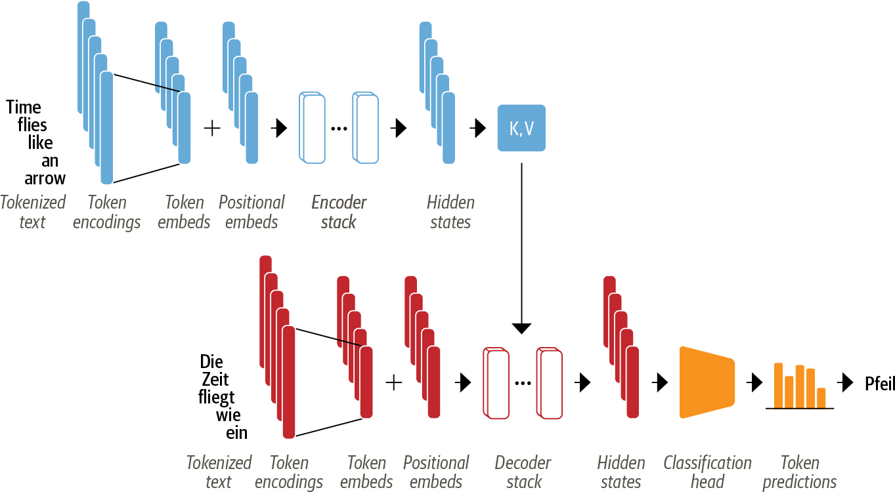

# NLP with Transformers chapter 3: Transformer anatomy
In this chapter, we will dive deeper into the Transformers architecture, exploring the main building blocks of a transformer model. We will first focus on constructing the attention mechanism and then integrate all the necessary components to make the encoder function. Additionally, we'll highlight the key distinctions between the encoder and decoder modules.  
Fasten your seatbelt, it's time to explore the wonders of NLP✨.

## The Transformer Architecture
The original form of transformer was initially based on the encoder-decoder architecture primarily used for translation tasks.  
This architecture consists of two main components :  
  
  ***Encoder :***  
  convert an input sequence into a sequence of embeddings (hidden state).
 
    
***Decoder :***  
uses its output and the encoder's hidden state to iteratively generate the output sequence.

Scary, isn't it🫣? Don't worry. We're here to make it simpler.

## The Encoder 

