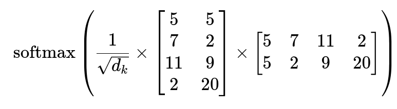
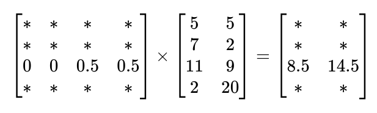

# NLP with Transformers chapter 3: Transformer anatomy
In this chapter, we will dive deeper into the Transformers architecture, exploring the main building blocks of a transformer model. We will first focus on constructing the attention mechanism and then integrate all the necessary components to make the encoder function. Additionally, we'll highlight the key distinctions between the encoder and decoder modules.

Tighten your seatbelt, it's time to explore the wonders of NLP✨.

## The Transformer Architecture
The original form of transformer was initially based on the encoder-decoder architecture primarily used for translation tasks, However, this design faced challenges in effectively handling long sequences. This is where the attention mechanism comes into play.  

The transformer consists of two main components :  
  
  ***Encoder:***  
convert an input sequence into a sequence of embeddings (hidden states).
 
    
***Decoder:***  
uses its output and the encoder's hidden states to iteratively generate the output sequence.

Scary, isn't it🫣? Don't worry. We're here to make it simpler.

## The Encoder 
The transformer's encoder is composed of many layers. In each layer, a sequence of embeddings is passed through two main components:    
1) A multi-head self-attention layer
2) A fully connected feed-forward layer that is applied to each input embedding  

<<<<<<< HEAD
At the end of our encoder, we have output embeddings that maintain the same size as the inputs. They become more contextually aware. For example, if we refer to an "Apple phone", the word "Apple" will be updated to be more "company-like" and less "fruit-like".

To gain a clear understanding of how it truly works, let's begin with the most important component: the self-attention layer.

=======
At the end of our encoder, we have output embeddings that maintain the same size as the inputs. They become more contextually aware. For exemple, if we refer to an "Apple phone",the word "Apple" will be updated at the end to be more "campany like" and less " fruit like".

To gain a clear understanding of how it truly works, let's begin with the first component.
### Word Embeddings

In Chapter 2, we learned that every word in our input sentence is tokenized, forming a tokens matrix of size (max_sentence_length, vocab_size). Next, we apply a pre-trained weighted matrix to the tokens matrix, transforming the tokenized text into vectors or token embeddings typically of 768 or 512 dimensions. Each dimension in these embeddings represents a distinct feature of the word, such as its fruitness.  

The problem is that these new embedding vectors are completely invariant to the position of the word. Luckily, there is an easy trick to capture position information. Let's take a look.  

### Positional Embeddings
Positional embeddinds are based on a simple technique: we add to each token embedding a new vector position of equal size. This approach gives to each word its positional information within the sentence.  
To create these vectors, we use sine and cosine functions, as illustrated below, where 'pos' represents the position of the word in the sentence, 'i' indicate the index in the vector position, and 'd_model' represents the embedding dimension.  
There are several reasons why this method is useful: first, the periodicity of the functions helps in capturing the word's position; additionally, the output of sine and cosine falls between [-1,1], which is normalized. It won’t grow to an unmanageable numbers during calculations; furthermore, no additional training is required, as a unique representation is generated for each position.    

 

Now that we've encountered these concepts, we are ready to dive into the most important building bolck .
### Self-attention
As we saw earlier, each token is individually represented by a vector of either 768 or 512 dimensions. The main idea behind self-attention is to use the entire sequence to compute a weighted average matrix that describes the relationships between each token embedding and the other token embeddings within the same sentence. As a result, we end up with embeddings that capture context more effectively.  
To do so, we use a technique called:

#### the scaled dot product: 
There are four main steps to implement this mechanism :  

**1 )&nbsp;** Project each token into three vectors, called:
   - ***Query:&nbsp;&nbsp;*** represents the token from which the attention mechanism is getting the information, it's used to compare against all the key vectors.
   - ***Key:&nbsp;&nbsp;***  tells the attention mechanism which parts of the sequence are important for understanding the query.  
   - ***Value:&nbsp;&nbsp;*** holds the information (features) associated with each token in the sequence.
  

**2 )&nbsp;** Compute attention scores. we use the similarity function, which is the dot product of the embedding matrices. Query and Keys that are similar will have a large dot product,

**1 )&nbsp;** Project each token embedding into three vectors, called:
   - ***query :&nbsp;&nbsp;*** represents the token from which the attention mechanism is getting the information, it's used to compare against all the key vectors.
   - ***key :&nbsp;&nbsp;***  tells the attention mechanism which parts of the sequence are important for understanding the query.  
   - ***value :&nbsp;&nbsp;*** holds the informations (features) associated with each token in the sequence.    

  At the end, we put together all the queue vectors into one matrix, and we do the same for the key and value vectors, resulting in three distinct matrices.
  

**2 )&nbsp;** Compute attention scores. we use the similarity fonction, which is the dot product of the Query and Key matrix. query and keys that are similar will have a large dot product,

 **3 )&nbsp;** To prevent dealing with large numbers, we normalize the variance of the attention scores by dividing them by the square root of the dimension of the keys  $\sqrt{d_k}$, and then we apply a softmax function to convert the column values into a probability distribution.   

**4 )&nbsp;** Multiply the attention weights by the Value matrix to obtain updated embeddings.
  
    
$$
\text{Attention}(Q, K, V) = \text{softmax}\left(\frac{QK^T}{\sqrt{d_k}}\right)V
$$
  
  

#### To make it clearer, let's provide a simple example:

Let's consider the following sentence: 'I love Apple iPhones.' We will represent it in a two-dimensional embedding space, where the first dimension represents the fruitiness of the word, and the second represents the technology. 

||Fruitness|Technology|
|--------------|-------------|-------------|
| **I** | 5 | 5|
| **Love** | 7 | 2 |
| **Apple** | 11 | 9 |
| **Phones** | 2 | 20|

Let's now calculate the attention matrix and focus only on the word **"apple",** which was initially associated more with fruites than technology.

<!--
$$
\text{softmax}\left(\frac{1}{\sqrt{d_k}}\times\begin{bmatrix}
5 & 5 \\
7 & 2 \\
11 & 9 \\
2 & 20 \\
\end{bmatrix}
\times
\begin{bmatrix}
2 & 11 & 7 & 5 \\
20 & 9 & 2 & 5 \\
\end{bmatrix} \right)
$$
-->

we got : 

<!--
$$

\begin{array}{c|cccc}
& I & Love & Apple & Phones \\
\hline
I & * & * & * & * \\
Love & * & * & * & * \\
Apple & 0 & 0 & 0.5 & 0.5 \\
Phone & * & * & * & * \\
\end{array}
$$
-->
We can see that the word **'apple'** is more focused on the word **'phone'** compared to the other words. Finally, let's multiply our weighted matrix by the value matrix.

<!--
$$

\begin{bmatrix}
* & * & * & * \\
* & * & * & * \\
0 & 0 & 0.5 & 0.5 \\
* & * & * & * \\
\end{bmatrix}\times
\begin{bmatrix}
5 & 5 \\
7 & 2\\
11 & 9\\
2 & 20 \\
\end{bmatrix}=\begin{bmatrix}
* & * \\
* & *\\
8.5 & 14.5\\
* & * \\
\end{bmatrix}
$$
-->
**The Updated Apple Embedding :**&emsp; [Apple] = [8.5&emsp;14.5]

We can see how the embedding of the word 'Apple' becomes more company-like and less fruit-like.

